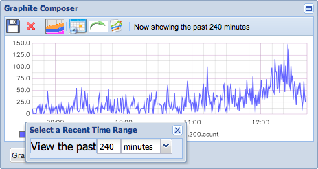
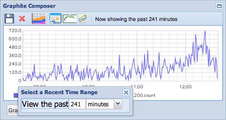

#### Preface

It is bittersweet being the 'tinkerer' out of my friends; on the upside, I love the attention and it satisfies
the little scientist in me.  On the downside, I usually have to figure it out myself, and usually cannot ask my friends
for help or insight, as they occasionally just do not care until it is done.

Like the rest of you, once I read [the inspirational blog post](http://codeascraft.com/2011/02/15/measure-anything-measure-everything/)
introducing StatsD by Etsy's engineering team, I had to install it. It just seemed so simple! Boy was I wrong.

Before you get started, [this blog post](http://kevinmccarthy.org/blog/2013/07/18/10-things-i-learned-deploying-graphite/)
covers a lot of the basics.  If you are unfamiliar with Graphite, go read sections 1, 2 and 3.  Then come back here.

Sections 4 and on deal with hurdles he had to overcome while installing, do not get bogged down with those yet. Go! I will wait.

#### Introduction

Graphite is a generic name for a complicated Rube Golderburg-esque group of applications all doing a specific
piece of the puzzle.  It is named as such, because Graphite is the name of the (original) front-end.

There are a number of different applications which make up the core package...

* Graphite - This is the web front-end, where you will design your graphs or just play around with the data.
* Carbon - Receives metrics over the network and writes them down to disk using a storage backend.
* Whisper - Similar to RRDTool, stores time-series data in a non-growable database. (Alternate: Ceres)

...and a number of helper applications, which not required, but do make things helpful.

* StatsD - An aggregator which bulk pushes data to Carbon after a flush interval.
* CollectD - A data collector similar to Nagios or Munin which sends data directly to Carbon.

#### Installation

We are going to install each of those five (5) components, so using a base CentOS 7 image, I ran the following:

    yum -y update
    yum install -y httpd net-snmp perl pycairo mod_wsgi python-devel git gcc-c++

After adding the EPEL repo (pretty much a requirement these days), I finished the installation.

    yum install -y python-pip node npm

I did the graphite install within pip, which means I had some caveats.  You might be able to rpm some of these to
avoid having to install specific versions.

    pip install 'django<1.6'
    pip install 'Twisted<12'
    pip install django-tagging
    pip install whisper
    pip install graphite-web
    pip install carbon

Finally, let's get grab the additional components.

    yum install collectd collectd-snmp
    git clone https://github.com/etsy/statsd.git /usr/local/src/statsd/

##### Configuration

That was the easy part! Now time to pull our your hair.  Until I get more time to explain, here are my configs.

    cp /opt/graphite/examples/example-graphite-vhost.conf /etc/httpd/conf.d/graphite.conf
    cp /opt/graphite/conf/storage-schemas.conf.example /opt/graphite/conf/storage-schemas.conf
    cp /opt/graphite/conf/storage-aggregation.conf.example /opt/graphite/conf/storage-aggregation.conf
    cp /opt/graphite/conf/graphite.wsgi.example /opt/graphite/conf/graphite.wsgi
    cp /opt/graphite/conf/graphTemplates.conf.example /opt/graphite/conf/graphTemplates.conf
    chown -R apache:apache /opt/graphite/storage/

`/opt/graphite/conf/storage-schemas.conf`

    [default]
    pattern = .*
    retentions = 10s:4h, 1m:3d, 5m:8d, 15m:32d, 1h:1y

If the retentions line is parsed improperly, you will get a `ValueError: need more than 1 value to unpack` error.
Double check your commas and colons to make sure your lines are proper.

*The single largest issue with setting up graphite is the tweaking and massaging of how often your data should be flushed
and how long it should be retained.*  On a production box, you will not want everything to have the same retention pattern.

The above code makes every statistic save 10 seconds for 4 hours, which then aggregates to 1 minute for 3 days,
5 minutes for 8 days, and finally 1 hour for 1 year.  This is an important topic, and you will not want this for
ALL of your metrics, but we will put a pin in this topic for now.

Create a super-user in graphite to save your graphs.

    cd /opt/graphite/webapp/graphite
    sudo python manage.py syncdb

#### Getting Started

_What do you mean we are not started yet??_  Relax, there are a lot of moving pieces to this.

    systemctl enable httpd
    systemctl start httpd
    /opt/graphite/bin/carbon-cache.py start

You can run the graphite development server just to make sure you have the front-end in order.

    /opt/graphite/bin/run-graphite-devel-server.py /opt/graphite/

If everything works, it will be started on port `:8080` with errors being displayed in the console. If that works,
the browse to the `http://localhost` and get the real application.

#### Collection

The helper applications are there to make your collection life easier.  You can fire off stats directly to Carbon,
there is nothing stopping you.  If you have a metric to capture at a time, send it to carbon directly.

    echo "local.random.diceroll 4 `date +%s`" | nc localhost 2003

However, if you have a need to consolidate data over time (sum/rate data BEFORE it gets to Carbon) or need something
to go out and get metrics (e.g. snmp polling) then you will want the helper applications.

For a small installation, these can be installed on the same server. As your installation grows, you will want to peel
off your collection daemons first.

##### StatsD

[StatsD](https://github.com/etsy/statsd/) is an amazingly simple application designed to "bucket" the statistics and
"flush" them at a predefined interval (along with addidional meta-statistics).  StatsD is designed to be run distributed
so that you can split the load.  Since it is just listening for data and sending it off in an interval, resource
utilization is relatively low.

The exampleConfig just really needs one line of change.  Just add the following before the last curly brace.

    , graphite: { legacyNamespace: false }

This will save you a lot of headache later with aggregation, which will already be a headache.  The new namespace will
ensure that counts are sent as `.count`, and per timeperiod rates as `.rate` to synchronize with your aggregation rules.

    cd /usr/local/src/
    node stats.js exampleConfig.js

This is going to run in the console, you are probably better off installing `forever` and running in the background.

    npm install forever -g
    forever start --uid 'statsd' stats.js exampleConfig.js

Now is a good time to [read the rest of Kevin's post](http://kevinmccarthy.org/blog/2013/07/18/10-things-i-learned-deploying-graphite/#make-sure-that-your-statsd-flush-interval-is-at-least-as-long-as-your-graphite-interval)
as it covers a VERY IMPORTANT topic: **Storage and Aggregation Calculations**.

##### CollectD

[CollectD](http://collectd.org/) the system performance collection daemon that reminds me of Nagios.  The good part here,
is that it can send directly to Carbon rather than it's own RRDs.  CollectD has a number of plug-ins and can be run on
each of your servers, or on a collection server (like Nagios) to get stats on each remote device.  Resource utilization
is pretty high from CollectD, because it is actively seeking statistics.

#### Aggregation

POP QUIZ: *Why is the first graph showing peaks at 150 when the second graph is showing peaks of 720?*

Welcome to **Aggregation Aggravation!**

Remember we set the `storage-schema.conf` to keep 10 seconds for 4 hours?  And did you notice that 240 minutes is 4 hours?

The first graph is showing you the full resolution and has 1440 (240 x 6 = (4 hours x 60 mins per hour ) x (60 secs per min
/ 10 secs per interval)) data points on it.  The second graph only has 240 datapoints on it, because each of those 10 second
datapoints were summed up to the next resolution (`1m:3d`) of 1 minute.

This brings up a very important point.  When you are selecting the most recent data, be mindful of which resolution you are
being returned!  Any selection within the first resolution time (`10s:4h`) will give me data in the order of 10 seconds

If you wanted to see per *minute* statistics in the last hour easily, you should not be storing 10 second data for longer
than 59 minutes for `count` data.  Example, set your retention pattern to `10s:59m, 1m:3d, 5m:8d`. Selecting the last hour
(60 mins) of data will cross retention boundries (as it is greater than 59 mins, but less than 3 days) and thus your data
will be presented to you in 1 minute increments.

If the neartime (near-realtime) factor is not important to you, then why keep intervals of 10 seconds at all if we just want
to see things per minute?  You do not have to! But you DO have to consider at which interval is your data flushing to carbon!

The aggregation rules are stored in `storage-aggregation.conf` and they really can be default. As the data hits the next
retention interval, it will `sum` all metrics ending with `.count`, and will `average` almost everything else (`min` and `max`
being the exceptions, where it will take the `min`, and, you guessed it, `max`, respectively).

Of course, since graphite is so powerful, you can have your cake (10 second interval near-realtime stats) AND eat it (viewing
recent datapoints on a per-minute basis) too!  The default graphing engine has a `summarize` function. If I apply the
`summarize` function to the 240 minute chart (which will give me the 10 second intervals and the 150 peak) at an interval of
`1min`, I can get the the peaks to 720, just like I want.

`summarize(stats.counters.web.www_hostname_com.GET.200.count,"1min")`

#### References

1. [http://graphite.readthedocs.org/en/latest/](http://graphite.readthedocs.org/en/latest/)
1. [https://ezunix.org/index.php?title=Install_statsd_and_graphite_on_CentOS_or_RHEL](https://ezunix.org/index.php?title=Install_statsd_and_graphite_on_CentOS_or_RHEL)
1. [http://stackoverflow.com/questions/19894708/cant-start-carbon-12-04-python-error-importerror-cannot-import-name-daem](http://stackoverflow.com/questions/19894708/cant-start-carbon-12-04-python-error-importerror-cannot-import-name-daem)
1. [http://stackoverflow.com/questions/17259279/valueerror-when-trying-to-start-carbon-cache](http://stackoverflow.com/questions/17259279/valueerror-when-trying-to-start-carbon-cache)
1. [http://wiki.cementhorizon.com/display/CH/How+to+install+graphite+on+a+bare+metal+CentOS+6.2+machine](http://wiki.cementhorizon.com/display/CH/How+to+install+graphite+on+a+bare+metal+CentOS+6.2+machine)
1. [http://blog.pkhamre.com/2012/07/24/understanding-statsd-and-graphite/](http://blog.pkhamre.com/2012/07/24/understanding-statsd-and-graphite/)
1. [http://bucksnort.pennington.net/blog/post/collectd-snmp-graphite/](http://bucksnort.pennington.net/blog/post/collectd-snmp-graphite/)
1. [https://gist.github.com/DrPheltRight/1071989](https://gist.github.com/DrPheltRight/1071989)
