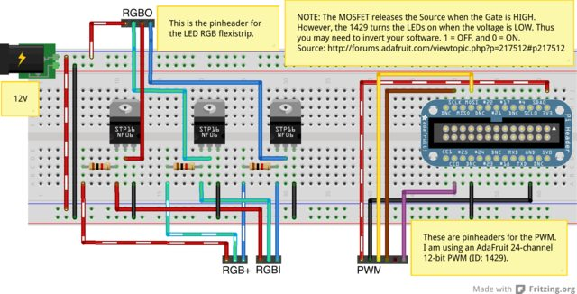

#### Disclaimer

I know next to nothing about low-voltage electronics. Even graduating from a well-known engineering university, I
cannot read an electronic schematic and I do not know how to read a transitor color stripe.

The audience of this document is for the competent newbie who would like to duplicate the results.

#### Preface

There are hundreds, if not thousands, of coding examples in Python for this exact project.  I do not know Python,
and thus I wanted to port this project to a language and platform I was familiar with.

#### Introduction

This project is designed to be a web-addressable RGB lighting experiment in NodeJS on a RaspberryPi.  The goal is
to create a basic webpage (served by NodeJS) to control the RGB LED strip.  In addition to the front-end, I want
to provide a REST API to both set and get the parameters.

#### Wiring Diagram

##### The Circuit

The circuit generally follows [this tutorial](http://learn.adafruit.com/rgb-led-strips/usage).

* Hook up the RPi to the PCA9685 breakout board using the I2C connections.
* Connect the 3.3V output from the RPi to VCC on the PCA9685 breakout board. Leave V+ unconnected.
* Connect the +12V from the LED strip to an external power supply (do NOT use your pi for this!)
* Connect the ground side of the power supply to the pi ground
* I used the N-channel MOSFETs - three of them, one for each channel
* Instead of using the PWM outputs from the arduino, we will use the PWM outputs from the PCA9685.
  * Connect up the PWM output 0 to the MOSFET with the red wire from the LED strip.
  * Output 1 goes to green
  * Output 2 goes to blue.

#### Hardware

The following is a parts list that I purchased from [adafruit.com](adafruit.com).

* 1x RGB LED weatherproof flexi-strip 30 LED - (1m) [ID:285] = $16.00
* 1x Solderless Analog RGB LED Strip Clip Sampler [ID:1004] = $5.90
* 1x Breadboarding wire bundle [ID:153] = $6.00
* 3x N-channel power MOSFET (30V / 60A) [ID:355] = $3.75
* 1x Raspberry Pi Model B 512MB RAM [ID:998] = $39.95
* 1x Adafruit Assembled Pi Cobbler Breakout + Cable for Raspberry Pi [ID:914] = $7.95
* 1x Full sized breadboard [ID:239] = $7.95
* 1x 12V 5A switching power supply [ID:352] = $24.95
* 1x Adafruit 12-Channel 16-bit PWM LED Driver - SPI Interface - TLC59711 [ID:1455] = $7.50

Notably missing, is a case, a 5V Micro USB power supply and a 4GB SD card for the Raspberry Pi.  The parts list,
with the missing items, is around $120.

#### Getting Started

_What do you mean we are not started yet??_  Relax, this project has a lot of moving (figuratively) parts to it.
Go order your parts, then finish reading the rest of the tutorial.  By the time you are finished, your parts
should have arrived.

##### Operating System

Adafruit recommends their own easy-to-use distro Occidentalis. I have no experience with it.  I will stick with
Raspbian, but does require additional configuration.  For this project, I used `2013-07-26-wheezy-raspbian`.

Once you complete the setup and upgrade of your image, remove (or comment out, with a #) the following line in
`/etc/modprobe.d/raspi-blacklist.conf`.

    blacklist i2c-bcm2708
    blacklist spi-bcm2708

Second, add the following lines to `/etc/modules` and reboot.

    i2c-bcm2708
    i2c-dev

After the reboot, install the `i2c-tools` package for troubleshooting.

    $ sudo apt-get install i2c-tools

If you have already built your circuit and connected it your RPi, run `sudo i2cdetect -y 1` and you will see
that addresses `0x40` and `0x70` are in use.

##### Software

Download and extract the latest version of node.

    wget http://nodejs.org/dist/v0.10.17/node-v0.10.17-linux-arm-pi.tar.gz
    tar xvzf node-v0.10.17-linux-arm-pi.tar.gz

Create and copy the binaries to their new home, give the current user ownership of the directory.

    sudo mkdir /opt/node
    sudo cp -r node-v0.10.13-linux-arm-pi/* /opt/node
    sudo chown -R $USER /opt/node

Set up login scripts. Copy the following into `/etc/profile`

    NODE_JS_HOME="/opt/node"
    PATH="$PATH:$NODE_JS_HOME/bin"

This setup allows you to quickly and efficiently upgrade `node` as desired and easily install a package
globally (`npm install -g package`) without requiring sudo.

#### References

1. https://github.com/kelly/node-i2c
1. https://github.com/fjw/node-leddriver
1. https://github.com/fjw/node-simplespi
1. https://github.com/pandringa/piStuff/blob/master/pwmTest.js
1. https://github.com/smithje/RGB_LED_Driver
1. https://github.com/technicalmachine/servo-pca9685
1. http://learn.adafruit.com/adafruits-raspberry-pi-lesson-4-gpio-setup/configuring-i2c
1. http://learn.adafruit.com/adafruit-16-channel-servo-driver-with-raspberry-pi/configuring-your-pi-for-i2c
1. http://blog.rueedlinger.ch/2013/03/raspberry-pi-and-nodejs-basic-setup/
1. http://www.instructables.com/id/Breadboard-Basics-for-Absolute-Begginers/
